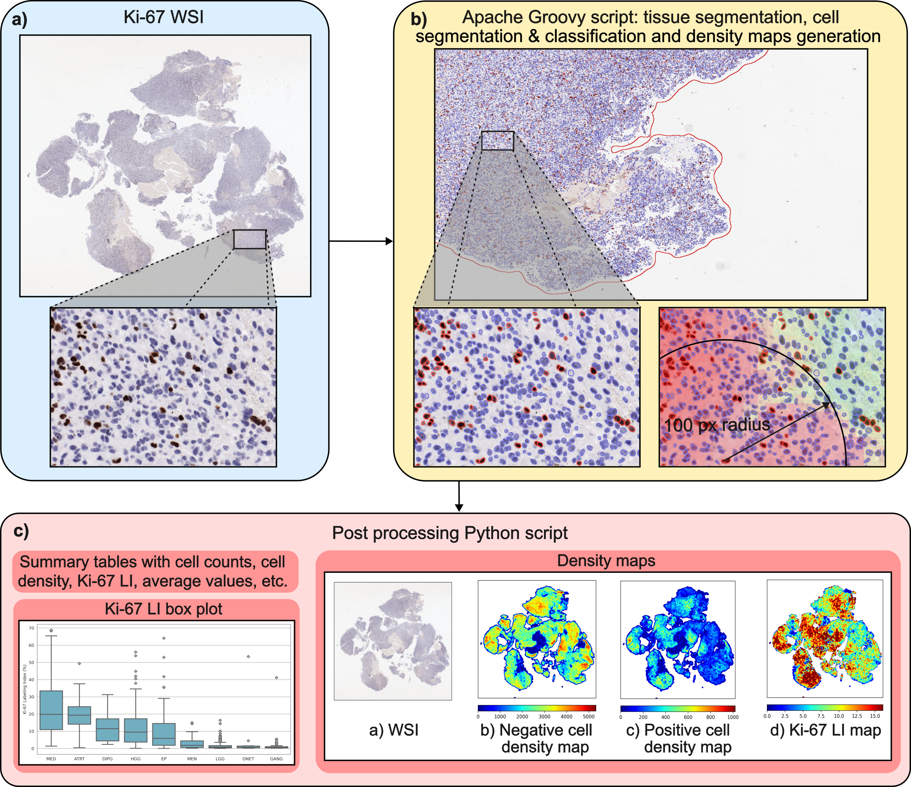
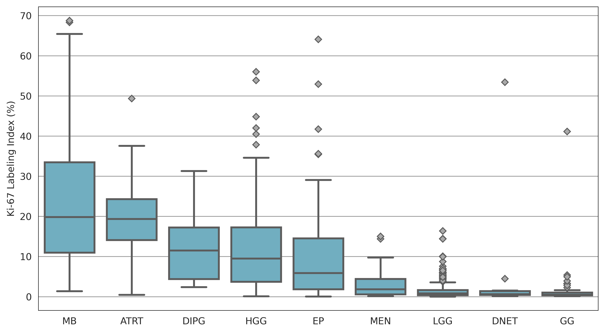

# Quantification of Ki-67 Labeling Index in Pediatric Brain Tumor Immunohistochemistry Images 

**Christoforos Spyretos, MSc**<sup>†,1,2</sup>, **Juan Manuel Pardo Ladino, MSc**<sup>1</sup>, **Hakon Andersen Blomstrand, MD, PhD**<sup>3,4</sup>, **Per Nyman, MD**<sup>2,5,6</sup>, **Oscar Snödahl, MD**<sup>2,6,7</sup>, **Alia Shamikh, MD**<sup>8,9</sup>, **Nils Elander, MD, PhD**<sup>4,10</sup>, **Neda Haj-Hosseini, PhD**<sup>1,2</sup>

<sup>1</sup>Department of Biomedical Engineering, Linköping University, Linköping, Sweden  
<sup>2</sup>Center for Medical Image Science and Visualization, Linköping University, Linköping, Sweden  
<sup>3</sup>Clinical Department of Clinical Pathology, Region Östergötland, Linköping, Sweden  
<sup>4</sup>Department of Biomedical and Clinical Sciences, Linköping University, Linköping, Sweden  
<sup>5</sup>Crown Princess Victoria Children's Hospital, Region Östergötland, Linköping, Sweden  
<sup>6</sup>Department of Health, Medicine and Caring Sciences, Linköping University, Linköping, Sweden  
<sup>7</sup>Clinical Department of Radiology in Linköping, Region Östergötland, Linköping, Sweden  
<sup>8</sup>Department of Clinical Pathology and Cancer Diagnostics, Karolinska University Hospital, Solna, Sweden  
<sup>9</sup>Department of Oncology-Pathology, Karolinska Institute, Solna, Sweden  
<sup>10</sup>Clinical Department of Oncology in Linköping, Region Östergötland, Linköping, Sweden  

<sup>\*</sup> Corresponding author: [christoforos.spyretos@liu.se](mailto:christoforos.spyretos@liu.se)

**Author Contributions:** C. Spyretos and J.M. Pardo Ladino contributed equally to this work.

---

This repository includes an Apache Groovy script (Java-based syntax) for automated Ki-67 LI scoring, along with a Python script for post-processing to generate summary tables and graphical representations of the Ki-67 scores, and visualize density maps.

[Article](https://academic.oup.com/jnen/advance-article/doi/10.1093/jnen/nlaf163/8513053) | [Cite](#reference)

## Abstract   
Quantification of the Kiel 67 (Ki-67) labeling index (LI) is critical for assessing proliferation and prognosis in tumors but manual scoring remains a common practice. We present an automated framework for Ki-67 scoring in whole slide images (WSIs) developed for research settings using an Apache Groovy code script for QuPath and complemented by a Python postprocessing script that provides cell density maps and summary tables. Tissue segmentation is performed by pixel classifiers and cell segmentation is conducted using StarDist, a deep learning model, followed by adaptive thresholding to classify Ki-67 positive and negative nuclei. The pipeline was applied to a cohort of 632 pediatric brain tumor cases with 734 Ki-67 WSIs from the Children’s Brain Tumor Network. Medulloblastomas showed the highest Ki-67 LI (median: 19.84), followed by atypical teratoid rhabdoid tumors (median: 19.36), brainstem glioma-diffuse intrinsic pontine gliomas (median: 11.50), high-grade gliomas (grades 3, 4) (median: 9.50), and ependymomas (median: 5.88). Lower indices were found in meningiomas (median: 1.84) and the lowest were seen in low-grade gliomas (grades 1, 2) (median: 0.85), dysembryoplastic neuroepithelial tumors (median: 0.63), and gangliogliomas (median: 0.50). The results demonstrate a significant correlation (P < .05) in Ki-67 LI across most of the tumor families/types aligning with neuro-oncology and neuropathology consensus.


<strong>Figure:</strong> Overview of the analysis workflow. (a) Ki-67 WSIs are imported into QuPath. Representative Ki-67 WSIs with zoomed-in 20 μm region from a subject diagnosed with HGG. Ki-67 negative nuclei are stained blue, and positive nuclei are stained brown. (b) Tissue segmentation, cell segmentation, and classification are performed by the Apache Groovy script. Image metadata and cell density maps are extracted using the classified nuclei with a search radius of 100 pixels (50 μm) and stored. (c) Density maps are processed and summary graphs and tables are produced by the Python script. Abbreviations: HGG, high-grade glioma; Ki-67 Kiel 67; WSIs, whole slide images.


<strong>Figure:</strong> Box plot of Ki-67 LI across the tumor families/types at a WSI level. Abbreviations: Ki-67, Kiel 67; LI, labeling index; WSI, whole slide image.

## Table of Contents
- [Setup](#Setup)
- [Apache Groovy Script](#groovy)
- [Post Processing Python Script](#post-processing)
- [Acknowledgements & Funding](#acknowledgements--funding)
- [Reference](#reference)
- [License](#license)
---

## Setup

1. **Install QuPath**  
   Download and install [QuPath](https://qupath.github.io), an open-source software platform for digital pathology image analysis, from its official website.

2. **Clone the Repository**  
   Clone this repository by following the official GitHub instructions on [how to clone a repository](https://docs.github.com/en/repositories/creating-and-managing-repositories/cloning-a-repository).

3. **Create a Project Folder**  
   Inside the cloned repository, create a new folder to serve as your QuPath project workspace. For example, it can be named *Ki-67 Project*.

4. **Prepare Metadata**  
   Create a `.csv` file with the following headers:  
   - `case_id`: unique id for each patient or case.  
   - `slide_id`: id for the whole slide image.  
   - `label`: label used for grouping or classification (e.g., tumor type).  

   Below is an example of how the `.csv` file should look:  
   | case_id   | slide_id   | label   |
   |-----------|------------|---------|
   | case_001  | slide_001  | label_1 |
   | case_002  | slide_002  | label_2 |
   | case_003  | slide_003  | label_1 |

   If either `case_id` or `slide_id` is unavailable, the same value can be used for both fields.

5. **Install Miniconda**    
   Download  and install [Miniconda](https://docs.conda.io/projects/conda/en/latest/index.html) from the official website, it is needed to be able to run the python post-processing script.

6. **Create a Conda Environment**  
   Open a terminal window and create a conda environment following the [instructions](https://docs.conda.io/projects/conda/en/latest/user-guide/tasks/manage-environments.html) from the official website. For example run in the terminal `conda create -n qupath python=3.12`.

7. **Activate the Environment**  
   Activate the conda environment executing the command `conda activate qupath`.

8. **Install Required Dependencies**
   In the terminal, navigate to the cloned repository directory, then execute the command `pip install -r requirements.txt` to download the required libraries to be able to run the python post-processing script.

## Apache Groovy Script

To run the Apache Groovy script for automated Ki-67 labeling index (LI) scoring, follow the steps below:

1. **Open QuPath**  
   Launch the QuPath application on your computer.

2. **Create a New Project**  
   In QuPath, navigate to:  
   `File` -> `Project...` -> `Create project`  
   A window will appear prompting to select a directory. Choose the folder that will serve as the QuPath project workspace (e.g., Ki-67 Project).

3. **Add Images to the Project**  
   In QuPath, navigate to:  
   `File` -> `Project...` -> `Add images`  
   A file browser window will open, either drag and drop the WSIs into this window or navigate through the filesystem to import them. Once imported, the images will appear in the project panel on the left-hand side of the QuPath interface.

4. **Import the StarDist Extension**  
   Navigate to the directory where the repository is cloned, then to QP_Extensions -> extensions. Drag and drop the *qupath-extension-stardist-0.5.0.jar* file into the QuPath window. It will be asked to set a folder to save the program extensions, which can be the same folder where the file was dragged from. The documentation
   of using StarDist within QuPath is available (here)[https://qupath.readthedocs.io/en/stable/docs/deep/stardist.html].

5. **Run the Project Script**  
   To execute the Groovy script, navigate in the QuPath window to:  
   `Automate` -> `Shared scripts` -> `Pos_cellD_QuPath_project`  
   This will open the Script Editor window.
   - To process a single image, click `Run`, and relevant output will be shown in the Script Editor. Note that the results must be saved manually before closing QuPath.
   - To process multiple images, click the three dots next to Run, choose Run for project, select the images to analyze, and click OK. A progress window will appear, and relevant output will be shown in the Script Editor.

6. **Review Results**  
   After processing, tissue segmentation, cell segmentation, and classification can be reviewed directly in QuPath interface. Additionally, a data folder will be created in the project's directory (e.g., Ki-67 Project), in which the output files generated by the Pos_cellD_QuPath_project script are stored. A results folder will also be generated, containing:
   - an Area_Det.txt file, which includes the annotation area (in mm²) and total cell count per WSI.
   - a Raw Density Maps folder, which stores the raw cell density map images created during analysis.

## Post Processing Python Script
To run the post-processing Python script follow the steps below:

1. Open a terminal window.

2. Activate the conda environment executing the command `conda activate qupath`.

3. Navigate to the directory, in which the repository is cloned.

4. Then execute the following command:
    ```bash
    python summary_ratios.py --maps_dir MAPS_DIRECTORY --data_dir PROJECT_DATA_DIRECTORY --area_path PATH_to_AREA.txt --csv_path PATH_to_csv --WSIs_dir WSI_DIRECTORY --norm_maps_dir NORM_MAPS_DIRECTORY --result_dir RESULT_DIRECTORY
    ```
    Arguments:
    - `--maps_dir`: Directory of the cell density maps generated by QuPath.
    - `--data_dir`: Directory of the project data.
    - `--area_path`: Path to the `Area.txt` file which is saved under the Results folder.
    - `--csv_path`: Path to the `.csv` file containing WSI metadata.
    - `--WSIs_dir`: Directory of the folder where the WSIs exist.
    - `--norm_maps_dir`: Directory where normalized density maps will be saved.
    - `--result_dir`: Directory where the summary tables and graphs will be saved.
   
   Once executed, the script will display progress in the terminal. It will generate:
   - a folder with the normalised positive and negative cell density, and Ki-67 LI maps.
   - a folder with summary graphs and tables will be generated.

## Acknowledgements & Funding
The research was made possible in part due to the [The Children's Brain Tumor Tissue Consortium (CBTTC)/The Children's Brain Tumor Network (CBTN)](https://cbtn.org). The study was financed by the Swedish Childhood Cancer Foundation
(MT2021-0011, MT2022-0013), the Joanna Cocozza’s Foundation (2025-2026), the Link€ oping University’s Cancer Strength
Area (2024), and the Medical Research Council of Southeast Sweden (FORSS-1011571).

## Reference
```
@article{spyretos2026quantification,
  title={Quantification of Ki-67 labeling index in pediatric brain tumor immunohistochemistry images},
  author={Spyretos, Christoforos and Pardo Ladino, Juan Manuel and Andersen Blomstrand, Hakon and Nyman, Per and Sn{\"o}dahl, Oscar and Shamikh, Alia and Elander, Nils and Haj-Hosseini, Neda},
  journal={Journal of Neuropathology \& Experimental Neurology},
  pages={nlaf163},
  year={2026},
  publisher={Oxford University Press}
}
```

## License
This work is licensed under [Creative Commons Attribution-NonCommercial-ShareAlike 4.0 International](https://creativecommons.org/licenses/by-nc-sa/4.0/).
